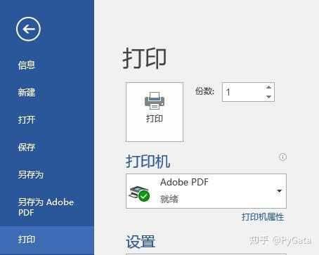
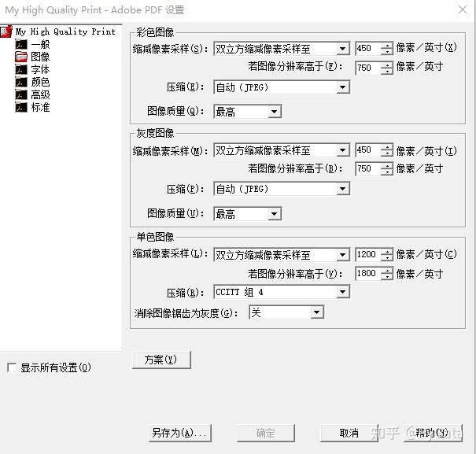
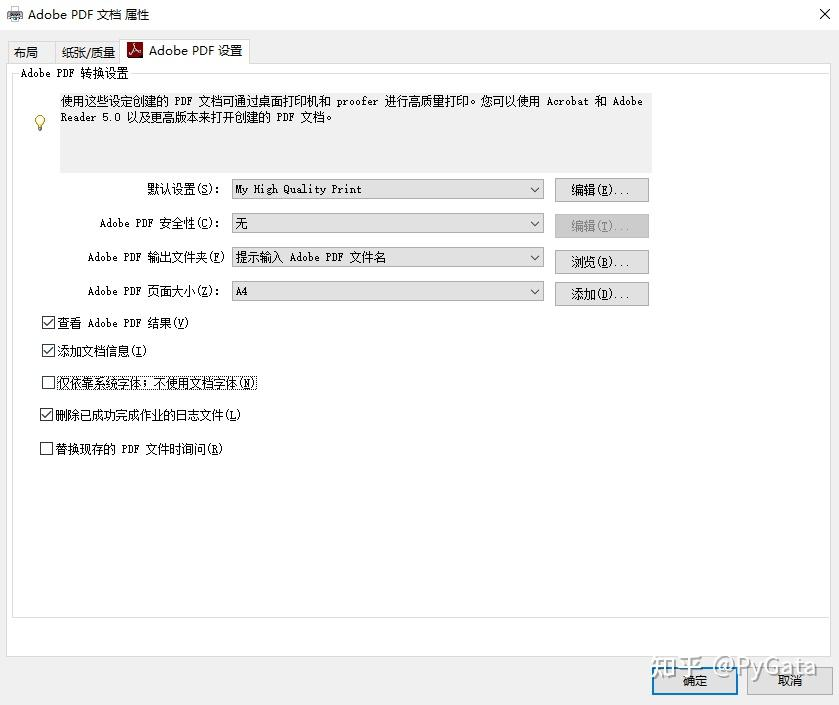
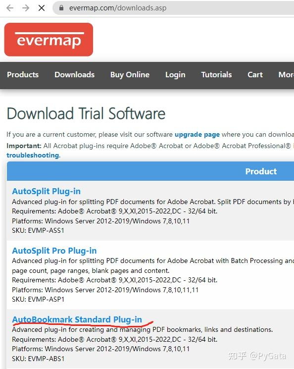

> 原文链接：[Word 转 PDF—保留图片高分辨率同时不丢失书签 _ 超链接]( https://zhuanlan.zhihu.com/p/611527301?utm_id=0)

## 一、打印高质量 PDF 文件（无书签、超链接）
*   ① 安装 Adobe Acrobat（本人使用的是 Adobe Acrobat Pro DC 2018 版）
*   ② 打开 word 文档，点击文件 - 打印，更改打印机为 Adobe PDF

*   ③ 点击打印机属性，更改默认设置为高质量，去掉 “仅依靠系统字体；不使用文档字体(N)” 前面的对号
*   ④ 点击确认，开始打印，获得 A.PDF（该 PDF 无书签、超链接）
*   ⑤ 如果图片分辨率依旧不够，在步骤 3 中点击默认设置后的 “编辑”，在弹出窗口的图像栏中修改彩色、灰度图像的分辨率上限，然后点击确认，保存 joboptions 文件。 (确保 word 中的图片分辨率低于该上限)

*   ⑥ 在打印机属性 - 默认设置中选择保存的 joboptions 文件，点击确认，重新打印。

## 二、设置书签、超链接

*   ① 打开 word 文档，点击文件 - 另存为 Adobe PDF，得到带书签、超链接的低图像分辨率 B.PDF
*   ② 为 Adobe Acrobat 安装 AutoBookmark Standard 插件，这是地址：[https://evermap.com/downloads.asp](https://evermap.com/downloads.asp)

*   ③ 安装插件，使用 Adobe Acrobat 打开 B.PDF，点击菜单栏 - 增效工具 - Bookmarks-Export-To Text，在弹出的窗口中勾选 Export bookmark actions，点击 OK，导出文本格式书签文件；点击菜单栏 - 增效工具 - Links-Export To Text，在弹出的窗口中点击 OK，导出带 “links.txt” 后缀的超链接文件。
*   ④ 打开 A.PDF，点击菜单栏 - 增效工具 - Bookmarks-Create From Text File，在弹出的窗口中点击 Browse，选择上一步保存的书签文件，然后点击 OK，此时书签已经导入；点击菜单栏 - 增效工具 - Links-Import From Text，选择上一步保存的超链接文件，然后点击 OK，此时超链接已经导入。
*   ⑤ 保存文件即可

## 三、小结
*   毕业季，希望这篇简短的教程能为大家提供些许帮助。
## 参考资料
*   参考 1：[word 转 pdf 不失真方法（文字、公式、图表、格式）](https://zhuanlan.zhihu.com/p/341224638)
*   参考 2：[教程，word 导出为 pdf 既要书签和链接又要高清图片](https://blog.csdn.net/cbszju/article/details/116885173)
*   参考 3：[自动生成 pdf 书签](https://www.cnblogs.com/zhuangliu/p/5667282.html)
*   参考 4：[word 转 pdf 图片不失真且有目录](https://blog.csdn.net/qq_15950515/article/details/122072847?spm=1001.2101.3001.6650.15&utm_medium=distribute.pc_relevant.none-task-blog-2%7Edefault%7EESLANDING%7Edefault-15-122072847-blog-116885173.pc_relevant_landingrelevant&depth_1-utm_source=distribute.pc_relevant.none-task-blog-2%7Edefault%7EESLANDING%7Edefault-15-122072847-blog-116885173.pc_relevant_landingrelevant&utm_relevant_index=22)