> 原文链接：[Obsidian 网页剪藏 - 简悦 + Local REST API](https://t.cj.sina.com.cn/articles/view/1823348853/6cae1875020016gl5)

作者：不大专业的酱酒打工仔

上篇说了 Obsidian 的安装与插件，大家也可以看下

一开始使用 Obsidian 的时候，有一个特别纠结的问题，就是没有自带的网页剪藏插件，网页剪藏基本占据我笔记的三分之一！然后在网上看到大神一些教程，了解到一个简藏的插件 "简悦"。这个插件可以把网页转换 md 格式，简单的编辑，再进行剪藏。

前期准备

- 简悦网页插件（2.0+） https://simpread.pro/
- 简悦配置库 https://www.yuque.com/kenshin/simpread/psugef

    内置 Obsidian 插件：
- Banners
- Dataview
- Local REST API

图片本地保存插件 local images 去插件库下载即可

- 简悦网页插件 (建议 2.0 以上)

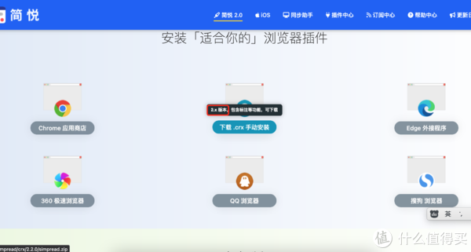
- 简悦配置库（极速版即可，文件名：obsidian@little.zip）

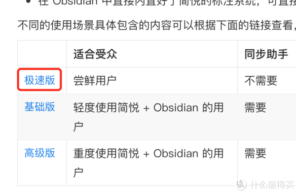

## 一、简悦插件安装配置（谷歌浏览器示例）

1. 解压插件

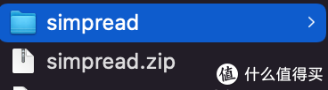
2. 安装插件

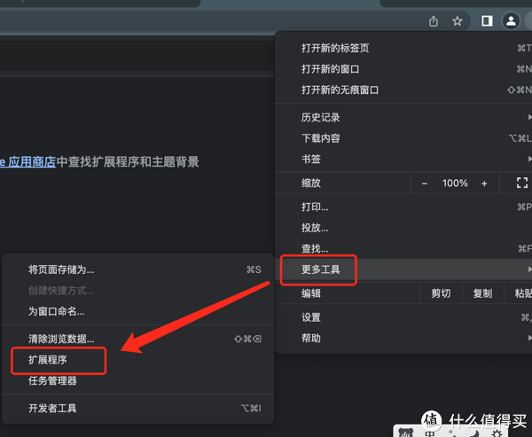
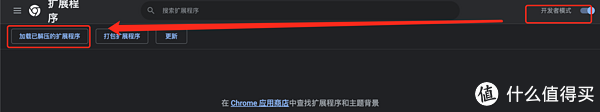
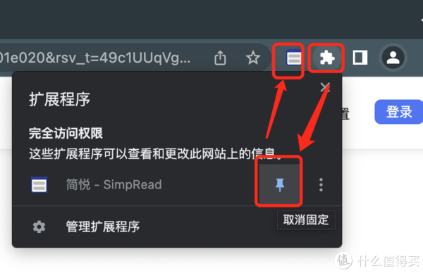
3. 导入插件配置，导入`obsidian@little`文件夹内的`simpread_config.json`

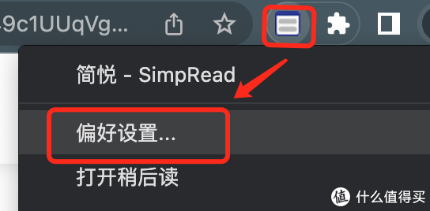
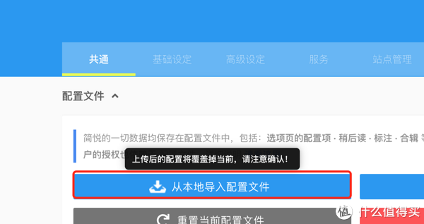
4. 导入插件

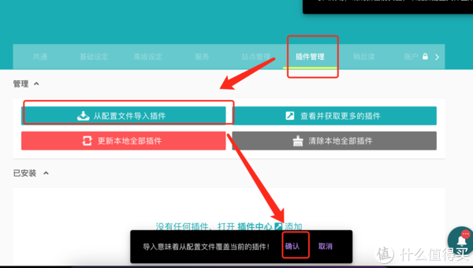
5. 插件配置，插件变红后点击，然后可以根据你习惯进行修改，我喜欢用的是`assets/1 网页`。官方给出的建议是用 Local REST API，但是我发现 SimpRead Sync 更好用（但是 SimpRead Sync 插件 github 链接发不出来）。所以还是用 Local REST API，Token 在 Obsidian 插件 Local REST API 的第一个 key 里面，修改完毕保存后刷新。（我这里）

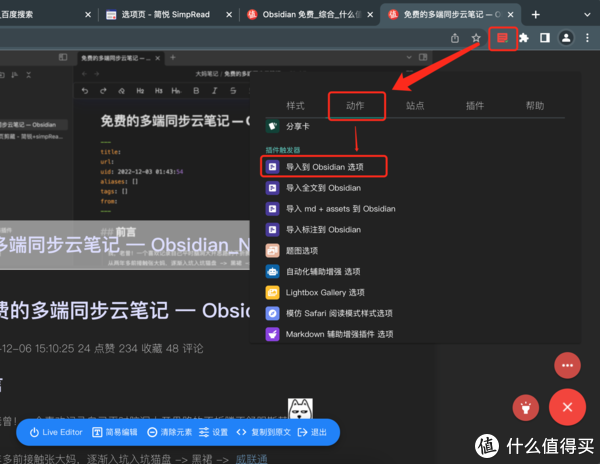
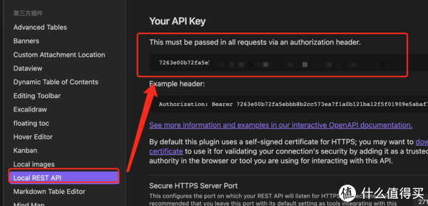
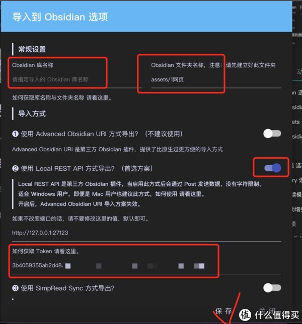
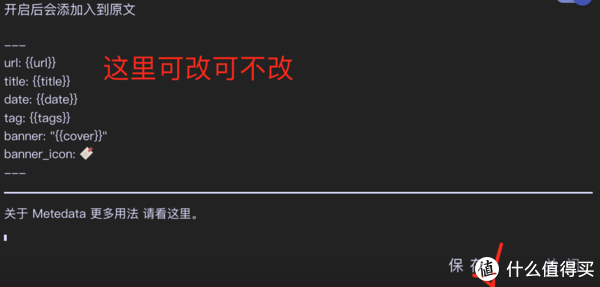
## 二、Obsidian 设置
1. 把`obsidian@little/Obsidian@simpread/.obsidian/plugins`的三个插件复制到 Obsidian 插件文件夹内，`obsidian@little/Obsidian@simpread/.obsidian`是隐藏文件夹

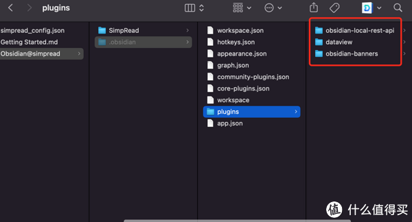
2. 把下载的 simpRead Sync 插件（simpread-obsidian-plugin-main.zip）解压复制到 Obsidian 插件内，重启 Obsidian。

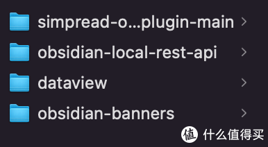
3. 打开全部插件，然后设置 Local REST API 插件，把 key 复制到插件的 Token。

## 三、一键剪藏
1. 打开 Obsidian 软件
2. 浏览器打开一个内容页面，等待插件简悦插件变红后点击
3. 点击剪藏

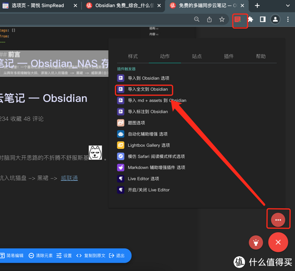
4. 完成剪藏

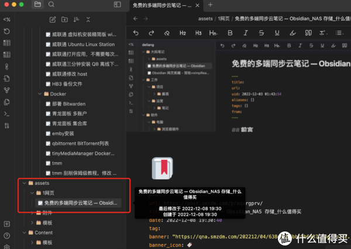
5. 图片保存到本地，下载图片保存插件 local images

  - 设置好保存附件文件夹就好。有条件的可以的可以压缩一下。

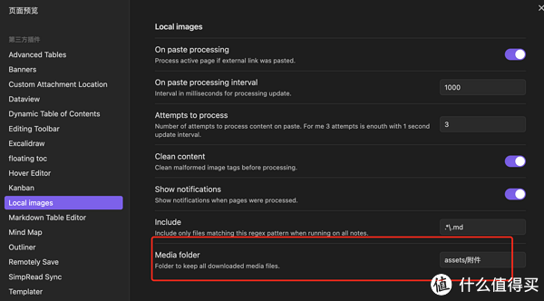
- 使用：打开命令面板 - 输入 `local images`，选择第二个即可。

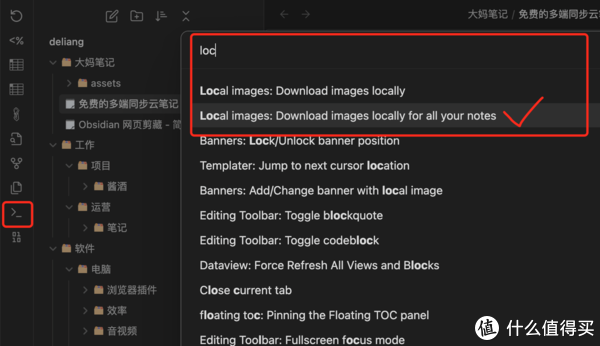
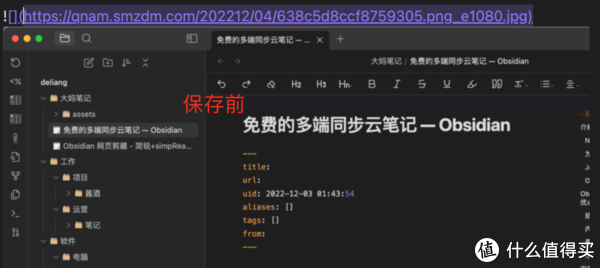
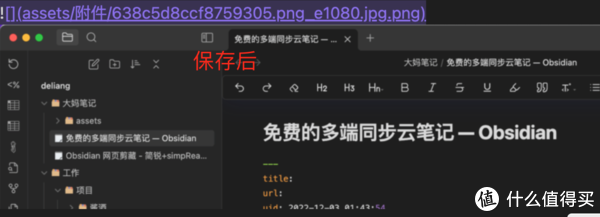

