> 原文链接：[【LaTeX 应用】常用数学公式和符号]( https://zhuanlan.zhihu.com/p/464237097)

在 latex 中，字符  `#`、 `$`、 `%`、 `&`、 `˜`、 `ˆ`、 `n`、 `_`、 `{`、`}` 的含义特殊，不能直接表示  

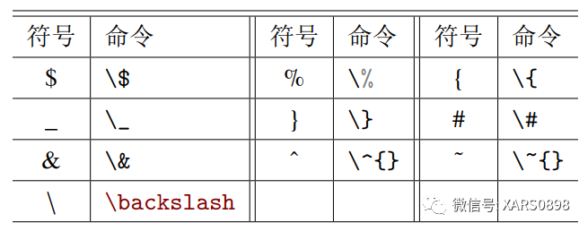

公式中常用到的希腊字母  

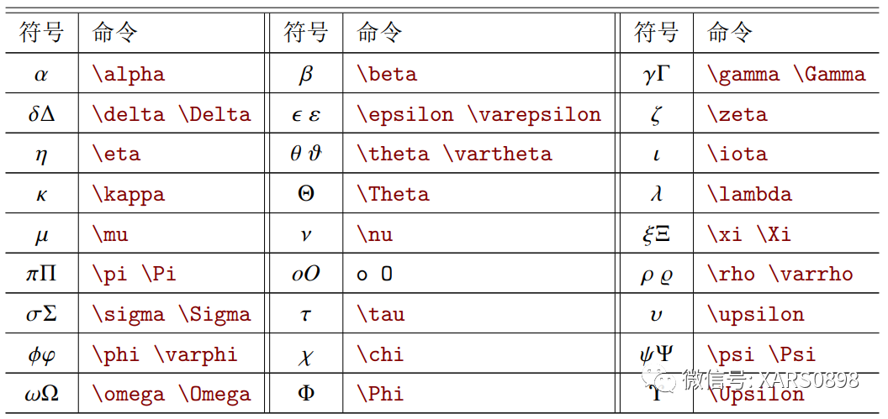

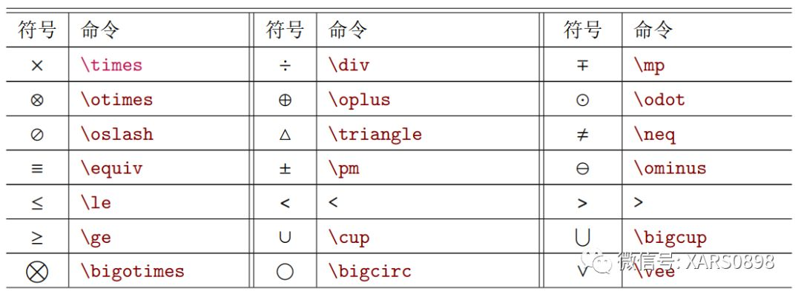

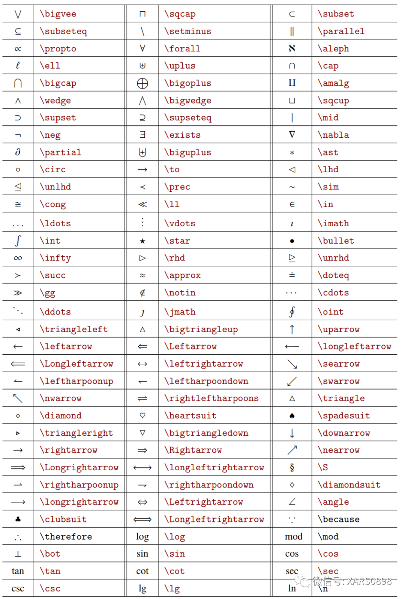

字体字形设置  

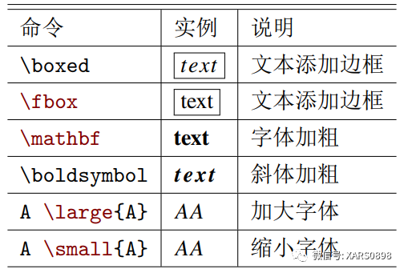

公式中常出现的式子样式  

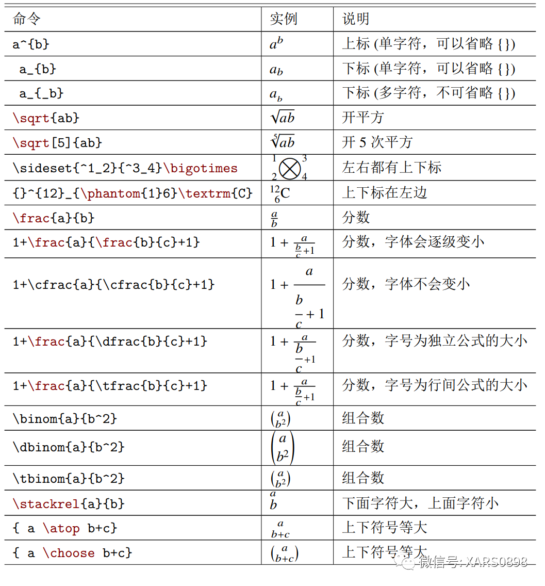

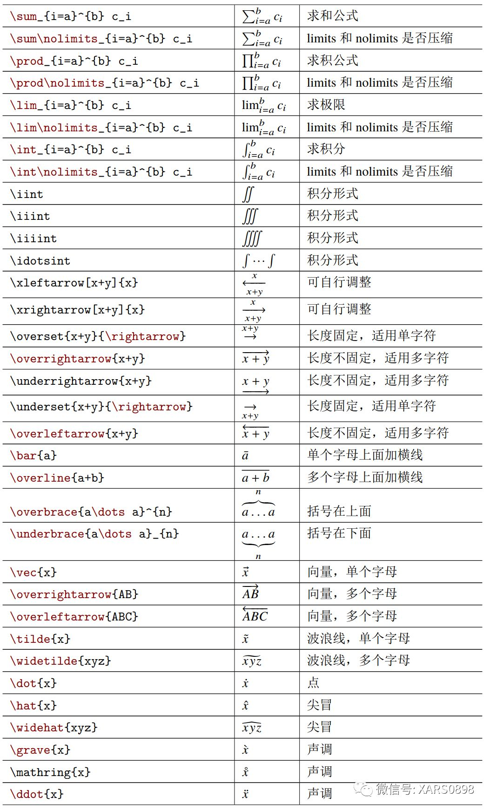

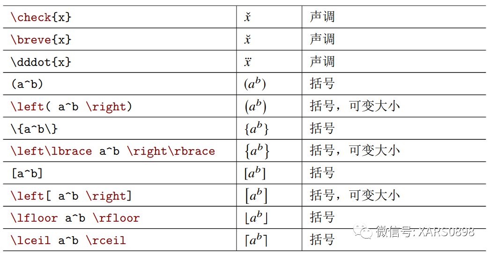

公式中插入文本，可以有 \ text{} 和 \ mbox{} 两种方式，区别在于文本样式调整可能存在差异。  
y = x2„二次方程”，代码为：y=x^2 (\text{二次方程});  
y = x2„二次方程”，代码为：y=x^2 (\mbox{二次方程})。  

公式中的空格  

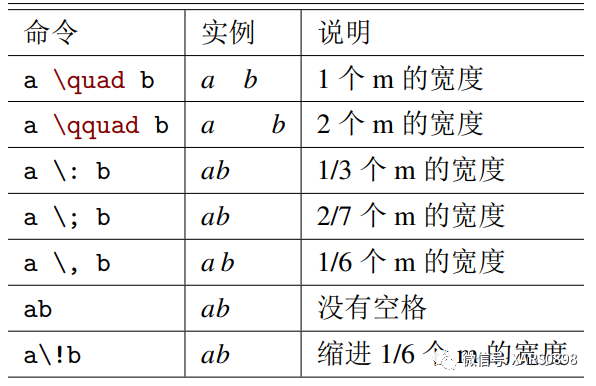

单行文本公式放在 “$” 与“$”之间，或者 “$$” 与“$$”之间，例如  

`$ y=x^2 $`

公式中括号的应用，可以用一系列命令 (\big, \Big, \bigg, \Bigg) 改变括号大  
小，例如  

`$ \Bigg( \bigg( \Big( \big((x) \big) \Big) \bigg) \Bigg) $$ \Bigg\{ \bigg\{ \Big\{ \big\{\{x\} \big\} \Big\} \bigg\} \Bigg\} $`

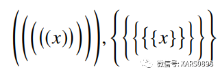

也可以用自动模式自动调节大小  

`$ f(x,y,z) = 3y^2z \left( 3+\frac{7x+5}{1+y^2} \right) $`

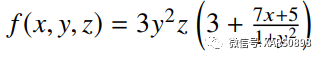

`$ f\left(\left[\frac{1+\left\{x,y\right\}}{\left(\frac{x}{y}+\frac{y}{x}\right)\left(u+1\right)}+a\right]^{3/2}\right)$`

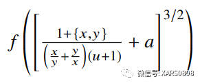

用 “$$” 与“$$”显示公式，可以自动居中，括号必须成对出现，如果在一行中只  
有一半的括号，则要添加对应的 “影子括号”，例如在一行中有“\left(”，则要在后面添加“\right.”，同理有“\left.” 和“\right)”。  

`\begin{aligned}a=&\left(1+2+3+ \cdots \right. \\& \cdots+ \left. \infty-2+\infty-1+\infty\right)\end{aligned}`

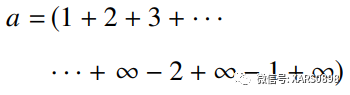

其中 “\begin{aligned}” 与“\end{aligned}”开辟一个环境，可以换行。  

分隔符 \ middle 的作用  

`$$ P=\left(A=2|\frac{A^2}{B}>4\right) $$$$ P=\left(A=2\middle|\frac{A^2}{B}>4\right) $$`

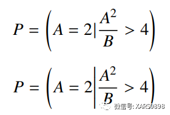

在单行文本中，不是只能写一行公式，只是整个公式占用一行  

`$$L(Y,f(X))=\begin{cases}1,\quad &Y\neq f(X)\\0,\quad &Y=f(X)\end{cases}$$`

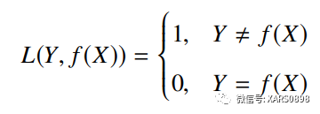

这里用到了 cases 环境，把多个情况放在一个公式中，每个情况用 \\ 换行  

在公式环境下编写公式，公式环境有很多种，这里列举一些常用环境。例如 equation  
环境，公式放在这个环境中，自动居中对齐，带有公式编号  

`\begin{equation}f(x)=3x^{2}+6(x-2)-1\end{equation}`

在 equation 环境中添加 aligned 环境，可以添加多行公式，每一行用 \\ 分隔结束  

`\begin{equation}\begin{aligned}f(x) &= (x+a)(x+b) \\&= x^2 + (a+b)x + ab\end{aligned}\end{equation}`

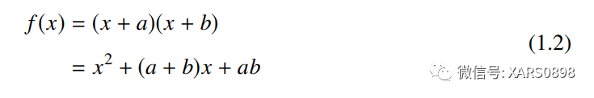

这里的 & 表示对齐的位置。在换行的时候，需要注意，如果涉及到括号中的拆分，就要用 “影子括号” 补全  

`\begin{equation}\begin{aligned}x=&\left( a+b+c+ \right. \\&\left. d+e+f+g \right) a\end{aligned}\end{equation}`

【LaTeX 应用】数学公式多行（换行）显示问题  

有时候需要方程组，把多个公式放在一起  

`\left.\begin{aligned}x+y &> 5 \\y-y &> 11\end{aligned}\\right\}\Rightarrow x^2 - y^2 > 55`

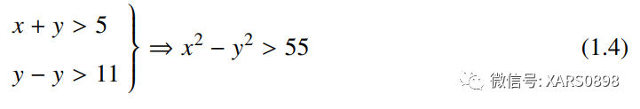

还可以把括号放在左边，只需要换一下 “影子括号” 位置就可以了。  
在 equation 环境中添加 array 环境，就可以实现数组或者表格的形式，其中每个元素用 & 分隔， \hline 表示横线。  

`\begin{equation}\begin{array}{c|l|c|r}n & \text{左对齐} & \text{居中对齐} & \text{右对齐} \\\hline1 & 0.24 & 1 & 125 \\\hline2 & -1 & 189 & -8 \\\hline3 & -20 & 2000 & 1+10i\end{array}\end{equation}`

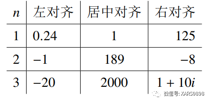

公式中如果有中文，就要用 \ text{} 或者 \ mbox{} 装载，否则不能正常输出中文。  
单行文本也可以表示矩阵和公式数组。  

`$$\left(\begin{array}{ccc|c}a11 & a12 & a13 & b1 \\a21 & a22 & a23 & b2 \\a31 & a32 & a33 & b3 \\\end{array}\right)$$`

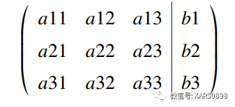

`$$\left\{\begin{array}{c}a_1x+b_1y+c_1z=d_1 \\a_2x+b_2y+c_2z=d_2 \\a_3x+b_3y+c_3z=d_3\end{array}\right.$$`

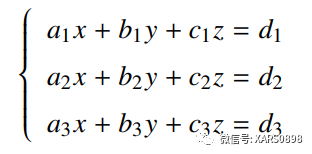

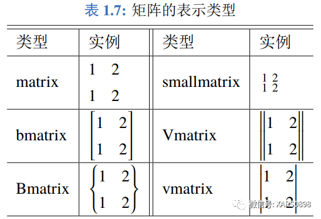

数学公式编辑可参考

【LaTeX 应用】数学公式 amsmath 包（说明文档）