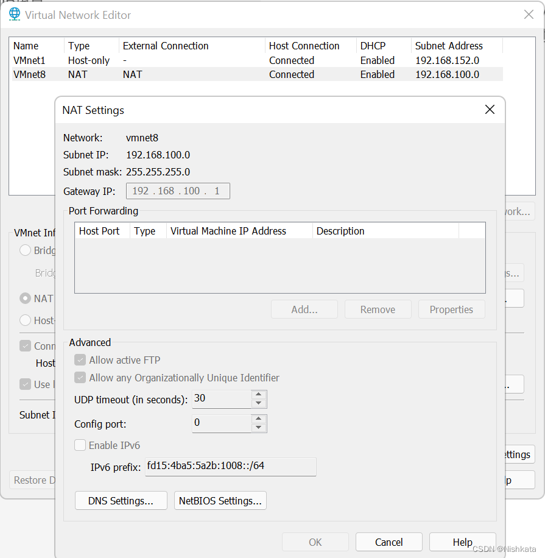
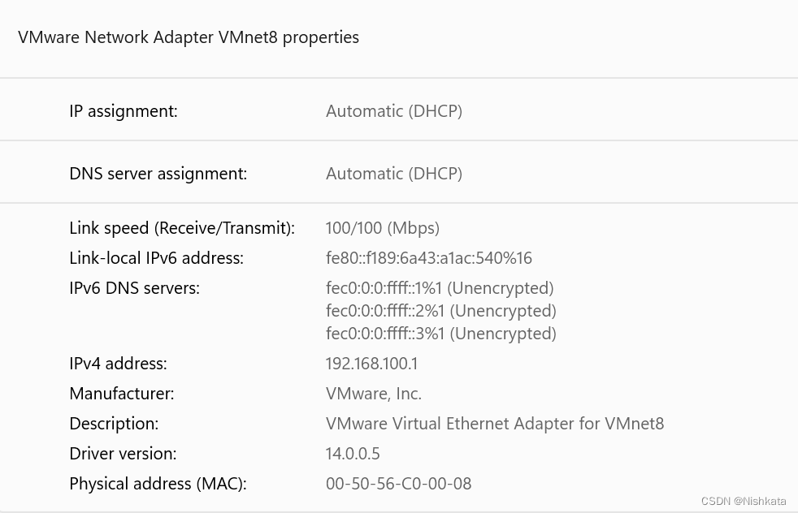

> 原文链接： [VMware 网络配置的坑：SSH 连接慢、Linux 无法上外网_usedns_no_Nishkata 的博客 - CSDN 博客]( https://blog.csdn.net/Nishkata/article/details/127934734)

# 症状

SSH 连接慢、Linux 无法上外网

# 尝试解决

网上说修改 SSH 配置文件的 UseDNS=no 就好了，也确实 SSH 连上了快了一些，但是无法上网；

# 原因

VMnet8 配置冲突：VMnet8 的网关配置为 192.168.100.1（通过 VMware 设置） ；而宿主机（Windows）在 VMnet8 上的 IP 也是 192.168.100.1（通过 Windows 网络设置进行设置，但是 DHCP 给分配的默认就是 192.168.100.1）。  
即这里的 Gateway IP  

  
不可以与这里的 IPv4 address 一样

