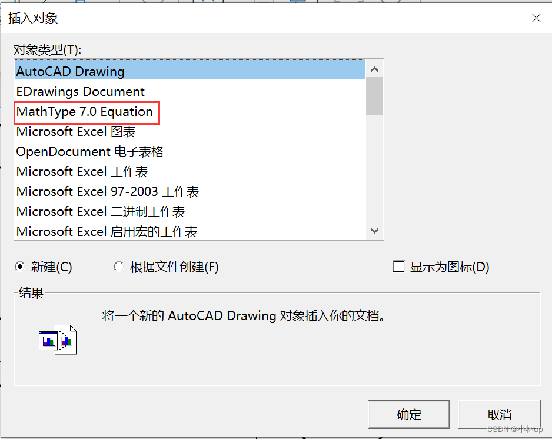

> 原文链接： [Visio 里 Mathtype 公式变形问题解决_visio 中 mathtype 变形_小林 up 的博客 - CSDN 博客]( https://blog.csdn.net/subtitle_/article/details/130034279)

直接从 word 或者 ppt 复制 MathType 公式到 Visio 里可能会发生公式的变形。查找了一下解决办法，记录一下。

建议不要只要从其他 office 软件直接复制过来，第一步，找到 Visio 工具栏的`插入`，然后选择`对象`。

  
双击插入就可以了。

  
后面的其他公式可以直接由这个对象进行复制了。

**参考**  
[永久性解决 Visio 中公式变形问题](https://blog.csdn.net/qq_33700120/article/details/115360914)