>  本文转自网络文章，转载此文章仅为个人收藏，分享知识，如有侵权，请联系博主进行删除。
>  原文地址： [Windows 修改启动服务及注册表提示拒绝访问解决方法_服务拒绝访问 - CSDN 博客](https://blog.csdn.net/jimmyxing001/article/details/140890369)

在 Windows 服务中修改服务启动类型时候弹出 “**拒绝访问**”，比如将 “**启动类型**” 配置为 “**手动**”

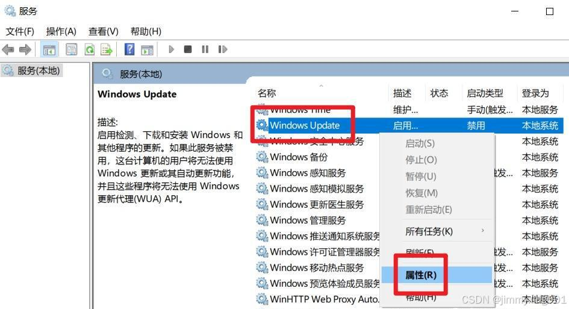

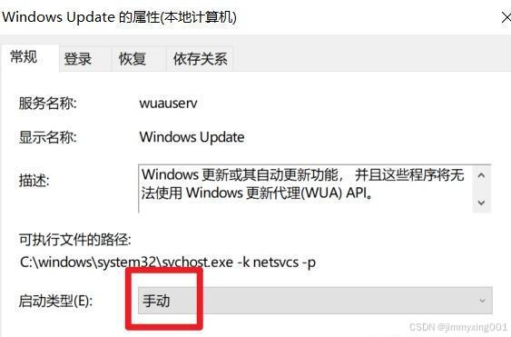

进行这一步配置时候有可能会出现如下图所示的 “**拒绝访问**” 选项。

针对这一种情况，我们进而加以解决。首先，还是同时按下`Windows徽标`键与`R`键，并输入`regedit`，打开[注册表编辑器](https://so.csdn.net/so/search?q=%E6%B3%A8%E5%86%8C%E8%A1%A8%E7%BC%96%E8%BE%91%E5%99%A8&spm=1001.2101.3001.7020)。

随后，在弹出的窗口中，依次找到服务对应的[注册表项](https://so.csdn.net/so/search?q=%E6%B3%A8%E5%86%8C%E8%A1%A8%E9%A1%B9&spm=1001.2101.3001.7020)， `\HKEY_LOCAL_MACHINE\SYSTEM\CurrentControlSet\Services\wuauserv` 这一栏，并右键选择 “**权限**” 选项；如下图所示。

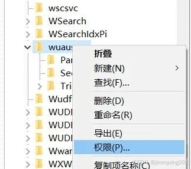

随后，我们选择`Administrators`用户，并在下方的 “**完全控制**” 处加以勾选，如下图所示。

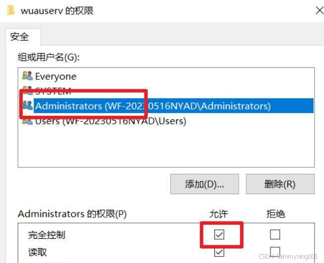

可是，有可能又会出现如下图所示的情况，即出现一个新的 “**拒绝访问**” 的报错提示。

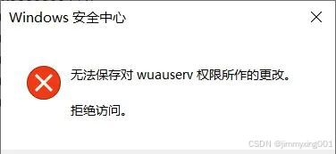

我们再针对这一情况加以解决。首先，我们还是进入刚刚配置权限的窗口中，选择 “**高级**” 选项。

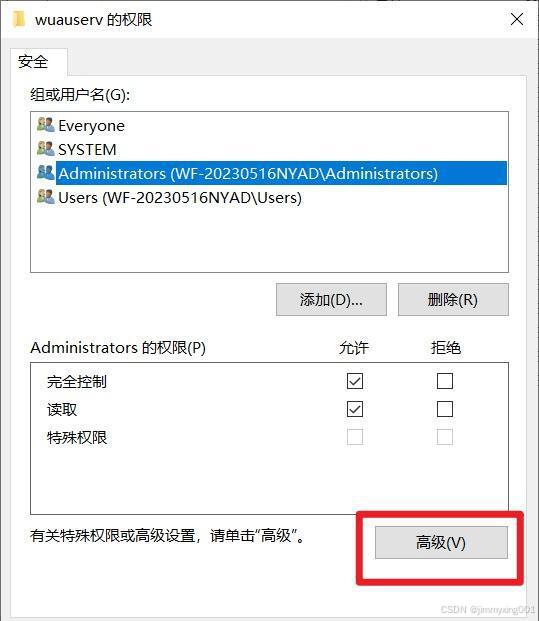

随后，在弹出的窗口中选择 “**审核**”→“**更改**” 选项。

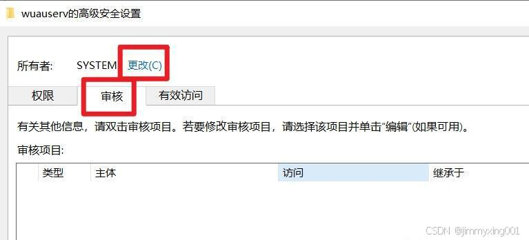

接下来，在弹出的窗口中，选择 “**高级**” 选项，并在新的窗口中选择 “**立即查找**”，如下图所示。

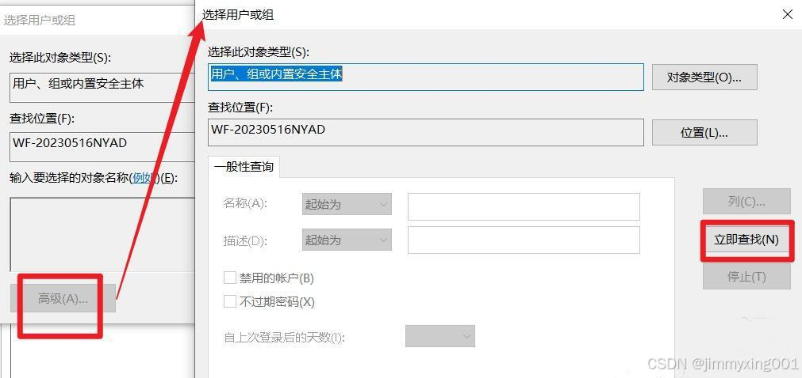

随后，我们找到`Administrators`用户，选中并选择 “**确定**”。

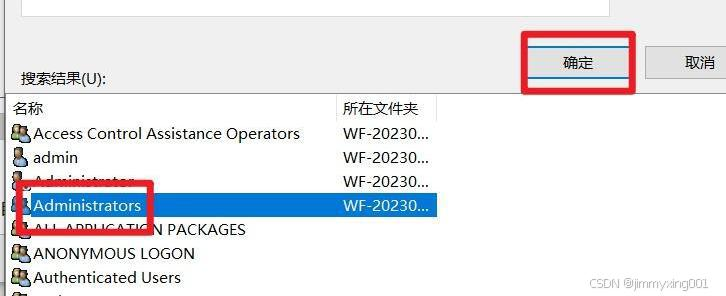

随后，我们选择 “**添加**” 选项。

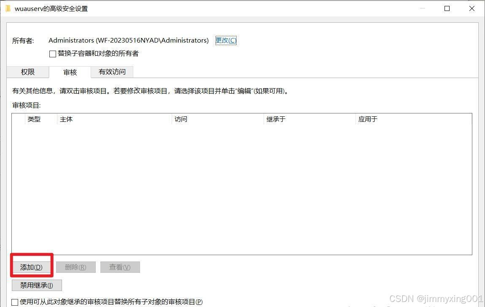

并如下图所示，依次选择 “**选择主体**”→“**高级**”→“**立即查找**”，找到`Administrators`用户后再点击 “**确定**”。

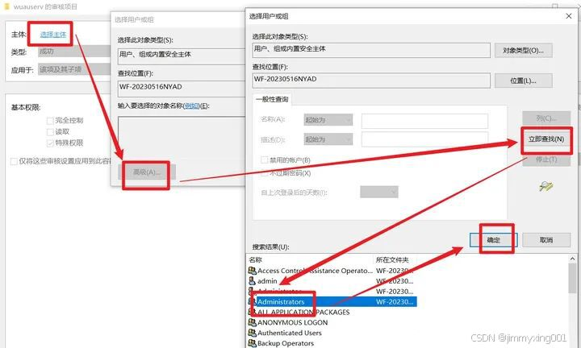

随后，在如下图所示的窗口中，将 “**完全控制**” 选项勾选中。

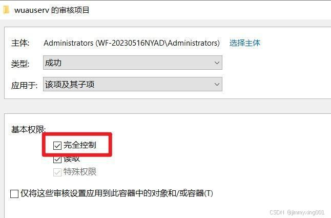

接下来点击 “**应用**” 并选择 “**确定**”。

此时，我们就可以在前述的属性款中，将`Administrators`用户的 “**完全控制**” 选项勾选中了。

接下来，我们就可以在如下图所示的窗口中，将 “**启动类型**” 可以正常修改为 “**手动**” 了。

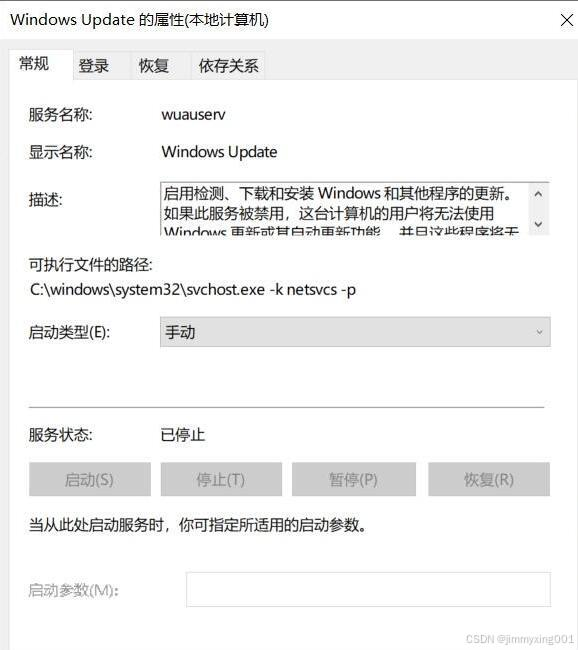