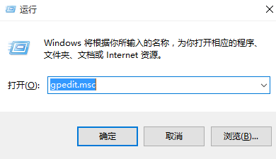
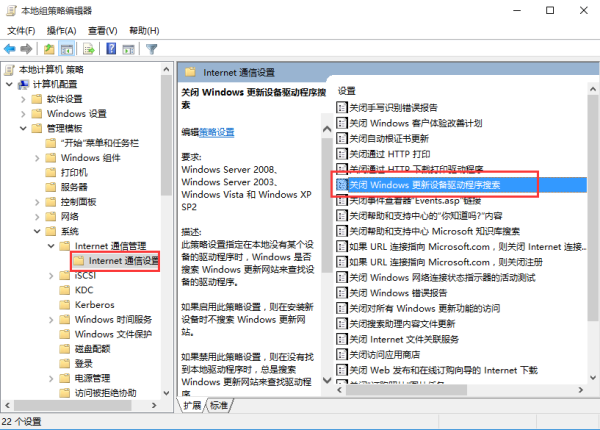
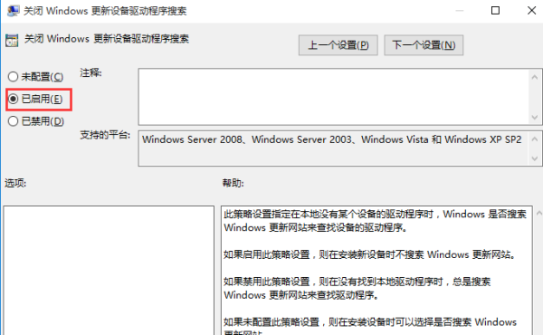
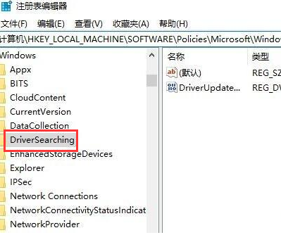
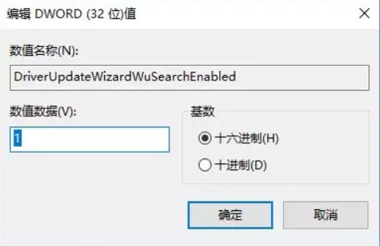
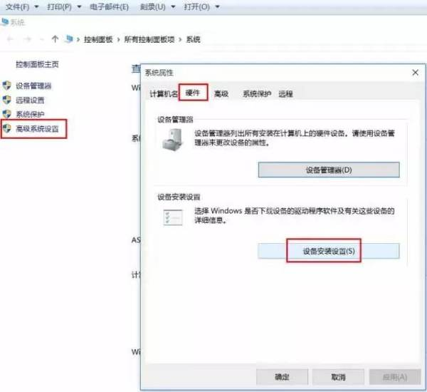
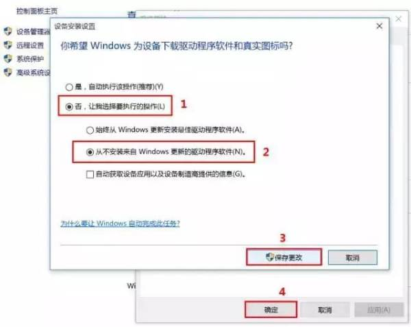

> 原文链接： [win10 怎么关闭自动显卡驱动更新？_百度知道]( https://zhidao.baidu.com/question/626147323581222612.html)

方法一：组策略禁止驱动自动更新

1、Win+R 组合键后输入 gpedit.msc 之后按回车键，打开组策略编辑器，如下图所示：

2、在组策略编辑器中展开→计算机配置→管理模版→系统→Internet 通信管理→点击右侧的 “Internet 通信管理”，之后找到 “关闭 Windows 更新设备驱动程序搜索”，双击打开其设置，如下图所示：

3、在设置界面中勾选 “已启用”，点击确定退出即可，如下图所示：

方法二：注册表禁止驱动自动更新

1、Win+R 组合键后输入 regedit 之后按回车键，打开注册表编辑器，如下图所示：

2、在注册表编辑器依次展开 HKEY_LOCAL_MACHINESOFTWAREPoliciesMicrosoftWindowsDriverSearching，如下图所示：

3、把右侧的 “DriverUpdateWizardWuSearchEnabled”，将默认的数值数据从“1” 修改成 “0” 后注销当前账户或重启电脑，就可以禁止当前电脑所有的硬件在 Windows Update 中获取驱动更新。

方法三：在 “硬件设置” 中禁止驱动自动更新

1、右击计算机图标，选择属性，点击高级系统设置，接着在弹出的窗口中点击 “硬件” 选项卡，选择“设备安装设置”，如下图所示：

2、接着在设备安装设置界面，选择 “否，让我选择要执行的操作”，选择 “从不安装来自 Windows 更新的驱动程序软件”，点击保存更改后确定就可以禁止当前系统自动更新驱动程序了。

