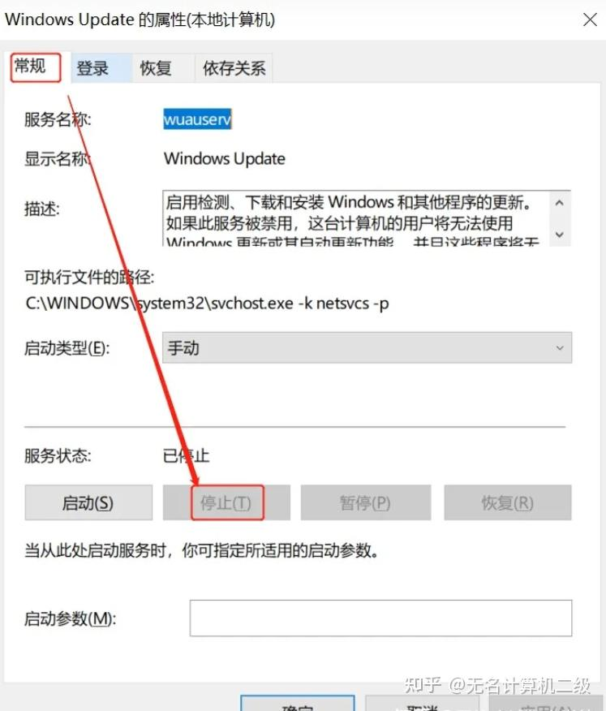

> 原文链接：[彻底关闭 Win10 自动更新]( https://zhuanlan.zhihu.com/p/637474191)

由于 win10 自动更新非常顽固，所以我们要从多个地方下手才能永久关闭其自动更新，别怕麻烦，跟着下面的步骤一步步操作。  
一、禁用 Windows Update 服务  
1、同时按下键盘 Win + R，打开运行对话框，然后输入命令 services.msc ，点击下方的 “确定” 打开服务。

2、找到 Windows Update 这一项，并双击打开。

3、双击打开它，点击 “停止”，把启动类型选为 “禁用”，最后点击应用。

  
4、接下再切换到 “恢复” 选项，将默认的 “重新启动服务” 改为“无操作”，然后点击“应用”“确定”。  

二、在组策略里关闭 Win10 自动更新相关服务  
1、同时按下 Win + R 组合快捷键打开运行命令操作框，然后输入 “gpedit.msc”，点击确定。

  
2、在组策略编辑器中，依次展开 计算机配置 -> 管理模板 -> Windows 组件 -> Windows 更新  

3、然后在右侧 “配置自动更新” 设置中，将其设置为 “已禁用” 并点击下方的 “应用” 然后“确定”。

4、之后还需要再找到 “删除使用所有 Windows 更新功能的访问权限”，选择已启用，完成设置后，点击 “应用”“确定”。  
三、禁用任务计划里边的 Win10 自动更新  
1、同时按下 Win + R 组合快捷键打开 ““运行” 窗口，然后输入 “taskschd.msc”，并点击下方的“确定” 打开任务计划程序。

  
2. 在任务计划程序界面上，依次点击【任务计划程序库】-【Microsoft】-【Windows】-【WindowsUpdate】。

3. 右键【Scheduled Start】选择【禁用】。如果有其它的也选择 “禁用”。

  
四、在注册表中关闭 Win10 自动更新  
1、同时按下 Win + R 组合快捷键，打开运行对话框，然后输入命名 regedit，然后点击下方的「 确定 」打开注册表。

2、在注册表设置中，找到并定位到 [HKEY_LOCAL_MACHINE\SYSTEM\CurrentControlSet\Services\UsoSvc]。然后在右侧找到 “Start” 键。

3、点击修改，把 start 值改成 16 进制，值改为 “4”，然后点击「 确定 」保存数据。

4、继续在右侧找到 “FailureActions” 键，右键点击修改该键的二进制数据，将 “0010”、“0018” 行的左起第 5 个数值由原来的 “01” 改为 “00”，完成后，点击下方的“确定” 即可。

5. 将以 "00000010" 和 "00000018" 开头的两行从左起第 5 个数值由原来的 "01" 改为 "00"，点击【确定】。

至此彻底关闭 win10 自动更新的操作步骤就全部完成了。