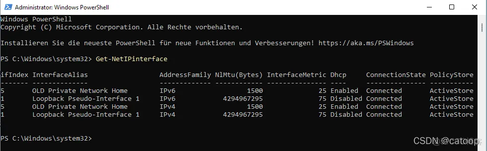
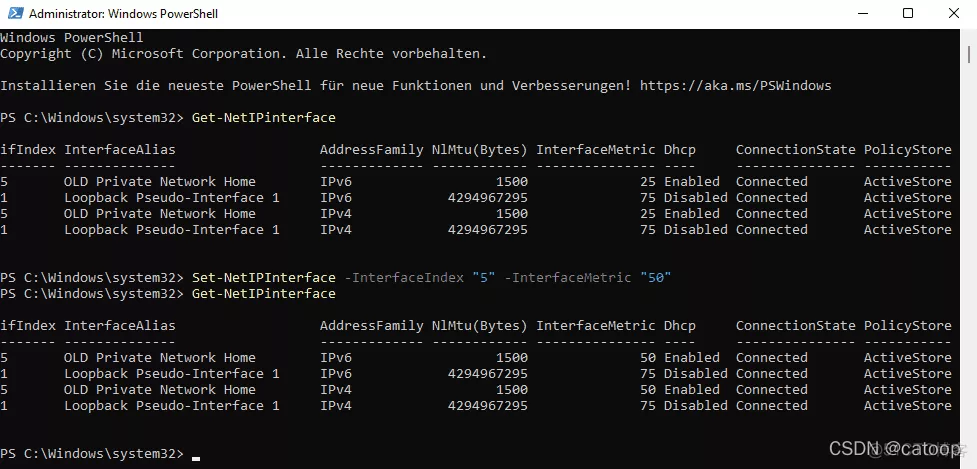
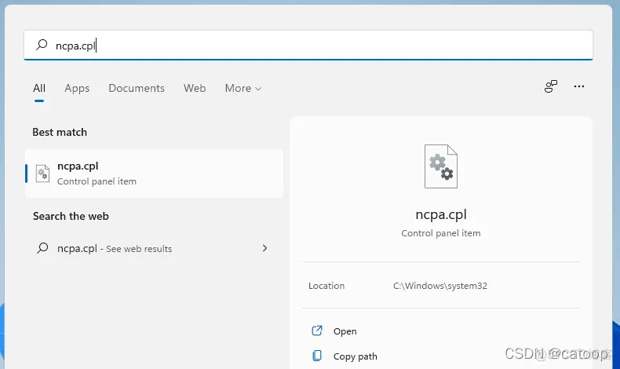
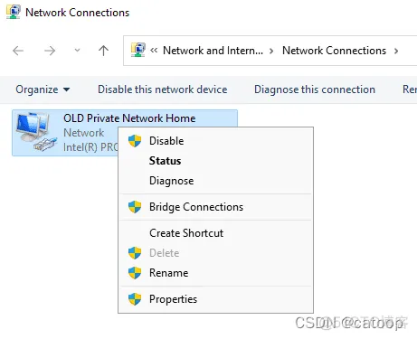
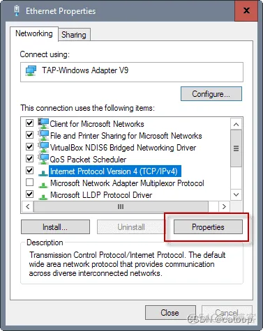
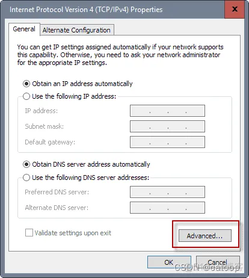
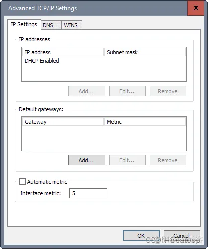

> 原文链接：[更改 Windows 11 上的网络适配器优先级_51CTO 博客_Win10 网络适配器各项设置]( https://blog.51cto.com/u_1472521/5113541)

Windows 11 设备使用网络适配器优先级来确定用于建立网络和 Internet 连接的网络适配器。如果一个设备有多个网络适配器，比如多个网卡、VPNS、虚拟机，或者一个网卡和一个 Wi-Fi 模块，可能无法立即确定它将用于连接到网络或 Internet。

好消息是您可以手动设置网络适配器优先级；这在某些情况下很有用，包括确保始终优先考虑特定适配器或解决连接问题。

​**在 Windows 11 中更改网络适配器优先级**​



您可能想要做的第一件事是检查所有网络适配器的当前优先级。

1.  选择开始。
2.  键入 Powershell。
3.  选择 “以管理员身份运行”。
4.  在 PowerShell 窗口中运行命令​`​Get-NetIPinterface​`​。
5.  该命令返回所有网络适配器及其接口索引号以及其他信息，例如连接状态。

第一列中显示的索引号对于每个网络适配器都是唯一的。InterfaceMetric 值定义优先级。较低的 InterfaceMetric 数字优先于较大的数字。

提示：该命令支持多个参数来自定义查询。一些有趣的选项包括：
- 命令 ​`​Get-NetIPInterface -AddressFamily IPv6​`​ 仅显示 IPv6 网络适配器。
- 命令 ​`​Get-NetIPInterface | Format-Table​`​ 格式化表格。
- 命令 ​`​Get-NetIPInterface -InterfaceIndex 12​`​ 显示有关索引为 12 的网络适配器的信息。

现在所需要做的就是根据要求设置值，基本命令是 ​`​Set-NetIPInterface -InterfaceIndex "XX" -InterfaceMetric "YY"​`​。

1.  InterfaceIndex 是指网络适配器的当前 ifIndex。
2.  InterfaceMetric 设置网络适配器的新优先级。

下面是一个例子：

```powershell
Set-NetIPInterface -InterfaceIndex "5" -InterfaceMetric "50"
```

这会将接口索引为 5 的网络适配器的优先级更改为 50。请注意，没有确认消息。



提示：该命令非常强大，因为它支持更改某些网络适配器特定属性的参数，例如添加 -Dhcp Disabled 以禁用指定适配器的 DHCP。

完成后，再次运行 Get 命令以确保更改设置正确。

* * *

PowerShell 提供了一个快速简便的选项来更改网络适配器优先级。您也可以使用网络连接控制面板小程序来修改优先级。

在网络连接中更改网络适配器优先级，您可以使用网络连接控制面板小程序更改网络适配器优先级。它提供的概述不如 PowerShell 选项好，但有些用户可能更喜欢图形用户界面而不是命令行选项。

您可能仍希望运行列出所有网络适配器及其优先级的 PowerShell 命令，因为您不会在网络连接小程序中获得概述。

​**步骤 1：打开网络连接控制面板小程序**​



选择开始。输入 ​`​ncpa.cpl​`​ 并运行命令；这将打开网络连接控制面板小程序。提示：查看我们在 Windows 上打开控制面板小程序的完整命令列表。

​**步骤 2：打开网络适配器的属性。**



右键单击要更改其优先级的网络适配器，然后从打开的上下文菜单中选择属性。

​**步骤 3：打开 IPv4 或 IPv6 协议的属性**​



找到 Internet 协议版本 4 (TCP/IPv4) 或 Internet 协议版本 6 (TCP/IPv6) 并选择属性按钮。如果要更改两者的优先级，请多次重复该过程。

​**步骤 4：打开协议的高级属性。​**



在打开的下一个屏幕上选择高级按钮。

​**步骤 5：更改适配器的优先级**​



接口度量值定义了适配器的优先级。将其更改为所需的优先级并选择确定以完成该过程。

* * *

（END）