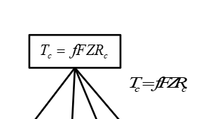
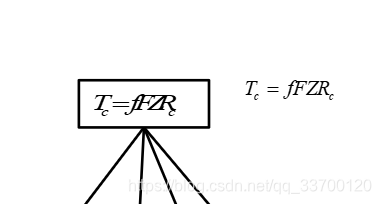

> 原文链接：[永久性解决 Visio 中公式变形问题_visio 中公式复制保存会变形 - CSDN 博客]( https://blog.csdn.net/qq_33700120/article/details/115360914)

## 问题描述

Visio中插入的 mathtypr 公式在经过复制、文件关闭重新打开等操作后会出现变形现象 (被莫名其妙的拉伸、缩放)。比如这样：  

## 网上的解决办法

双击公式进入编辑页面，全选，剪切，粘贴。  
这样能暂时解决问题，但再次对公式进行复制或者关闭文件再打开时还是会出现变形现象。

## 永久解决办法

每次输入公式都通过 插入 -> 对象 ->mathType Equation 新建一个公式。  
正常情况下第一个公式通过新建创建后，后面的公式就可以复制第一个公式然后在它基础上修改了，也一般也不会发生变形。but… 我遇到过特殊情况，我也不知道是做过什么神奇的操作，保险起见还是建议每次都重新新建。新建的时候麻烦一点，但后面都不用担心变形了。  

  
下图为对比效果，右边是通过上面步骤新建的，左边是从 word 复制过来的。  

