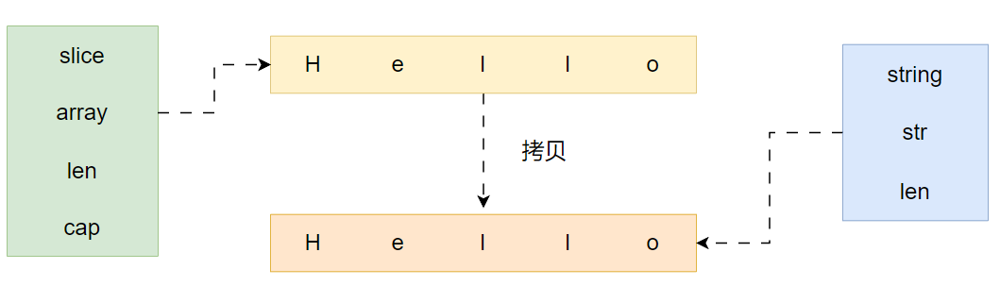
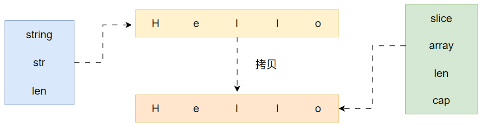

## 常规用法
```go
package main  
  
import (  
   "fmt"  
   "strings")  
  
func main() {  
   str := "abcdefg"  
   //string长度  
   length := len(str)  
   fmt.Println(length)  
   //遍历  
   for i, v := range str {  
      fmt.Printf("%d:%c\n", i, v)  
   }  
   //子串计数  
   cnt := strings.Count(str, "bc")  
   fmt.Println(cnt)  
   //未完待续  
}
```

## 简介
在 go 语言中，字符串其实就是一串由 UTF-8编码的字符序列。
- 字符串是所有 8 比特字节的集合，但不一定是 UTF-8 编码的文本
- 字符串可以为 empty，但不能为 nil ，empty 字符串就是一个没有任何字符的空串""
- 字符串不可以被修改，所以字符串类型的值是不可变的

## string 数据结构
```go
type stringStruct struct {
   str unsafe.Pointer    //  指向一个byte类型的切片指针
   len int
}
```
len 字段存储的是实际的字节数，而不是字符数，所以对于非单字节编码的字符，其结果可能多于字符个数
## string 与\[\]byte 之间的转换
### string 与\[\]byte 的转化原理

string 与\[\]byte 的转化其实会发生一次内存拷贝，或申请一块新的切片内存空间
byte 切片转化为string，大致过程分为两步：
1.  新申请切片内存空间，构建内存地址为addr，长度为len
2.  构建 string对象，指针地址为addr，len字段赋值为len（string.str = addr；string.len = len；）
3.  将原切片中数据拷贝到新申请的string中指针指向的内存空间



string转化为byte数组同样简单，大致分为两步：
1.  新申请切片内存空间
2.  将string中指针执行内存区域的内容拷贝到新切片



### \[\]byte 转化为 string 是否一定会发生内存拷贝
很多场景中会用到\[\]byte 转化为 string，但是并不是每一次转化，都会想上述过程一样，发生一次内存拷贝。在什么情况下不会发生拷贝呢？
转化为的字符串被用于临时场景
举几个例子：
1.  字符串比较：string(ss) == "Hello"
2.  字符串拼接：“Hello” + sting(ss) + "world"
3.  用作查找，比如 map 的 key，val := map\[string(ss)\]
    

这几种情况下，\[\]byte 转化成的字符串并不会被后面程序用到，只是在当前场景下被临时用到，所以并不会拷贝内存，而是直接返回一个 string，这个 string 的指针 (string.str) 指向切片的内存。
## 字面量声明  
go 语言中以字面量来声明字符串有两种方式，双引号和反引号:
```go
str1 := "Hello World"
str2 := `Hello
Golang`
```
## 字符串拼接
常见字符串拼接方式：
- + 操作符
- fmt.Sprintf
- bytes.Buffer
- strings.Builder
- append

### 性能测试
采用testing包下benchmark测试其性能

```go
package main

import (
   "bytes"
   "fmt"
   "strings"
   "testing"
)

const (
   str = "efwaefnurgnrehgepbnrebewnbgblasjfnowbgwooihfunw"
   cnt = 10000
)

// BenchmarkPlusConcat + 拼接
func BenchmarkPlusConcat(b *testing.B) {
   for i := 0; i < b.N; i++ {
      ss := ""
      for i := 0; i < cnt; i++ {
         ss += str
      }
   }
}

// BenchmarkSprintfConcat sprintf拼接
func BenchmarkSprintfConcat(b *testing.B){
   for i := 0; i < b.N; i++ {
      ss := ""
      for i := 0; i < cnt; i++ {
         ss = fmt.Sprintf("%s%s", ss, str)
      }
   }
}

// BenchmarkBuilderConcat stringbuilder 拼接
func BenchmarkBuilderConcat(b *testing.B){
   for i := 0; i < b.N; i++ {
      var builder strings.Builder
      for i := 0; i < cnt; i++ {
         builder.WriteString(str)
      }
      builder.String()
   }
}

// BenchmarkBufferConcat bytes.Buffer拼接
func BenchmarkBufferConcat(b *testing.B){
   for i := 0; i < b.N; i++ {
      buf := new(bytes.Buffer)
      for i := 0; i < cnt; i++ {
         buf.WriteString(str)
      }
      buf.String()
   }
}

// BenchmarkAppendConcat append 拼接
func BenchmarkAppendConcat(b *testing.B){
   for i := 0; i < b.N; i++ {
      buf := make([]byte, 0)
      for i := 0; i < cnt; i++ {
         buf = append(buf, str...)
      }
   }
}
```
### 性能原理分析
append > strings.Builder > bytes.Buffer > + > Sprintf
#### +
+拼接 2 个字符串时，会生成一个新的字符串，开辟一段新的内存空间，新空间的大小是原来两个字符串的大小之和，所以每拼接一次买就要开辟一段空间，性能很差
#### Sprintf
Sprintf 会从临时对象池中获取一个对象，然后格式化操作，最后转化为 string，释放对象，实现很复杂，性能也很差
#### strings.Builder
底层存储使用\[\]byte，转化为字符串时可复用，每次分配内存的时候，支持预分配内存并且自动扩容，所以总体来说，开辟内存的次数就少，性能相对就高
#### bytes.Buffer
底层存储使用\[\]byte，转化为字符串时不可复用，底层实现和 strings.Builder 差不多，性能比 strings.Builder 略差一点，区别是 bytes.Buffer 转化为字符串时重新申请了一块空间，存放生成的字符串变量，而 strings.Builder 直接将底层的 \[\]byte 转换成了字符串类型返回了回来，
#### append
直接使用\[\]byte 扩容机制，可复用，支持预分配内存和自动扩容，性能最好

